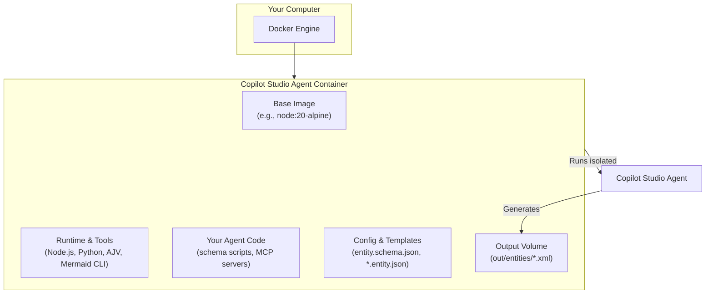

```mermaid
flowchart TB
    subgraph Host["Your Computer"]
        D[Docker Engine]
    end

    subgraph Container["Copilot Studio Agent Container"]
        B["Base Image\n(e.g., node:20-alpine)"]
        R["Runtime & Tools\n(Node.js, Python, AJV, Mermaid CLI)"]
        C["Your Agent Code\n(schema scripts, MCP servers)"]
        F["Config & Templates\n(entity.schema.json, *.entity.json)"]
        O["Output Volume\n(out/entities/*.xml)"]
    end

    D --> Container
    Container -->|Runs isolated| Agent["Copilot Studio Agent"]
    Agent -->|Generates| O
```