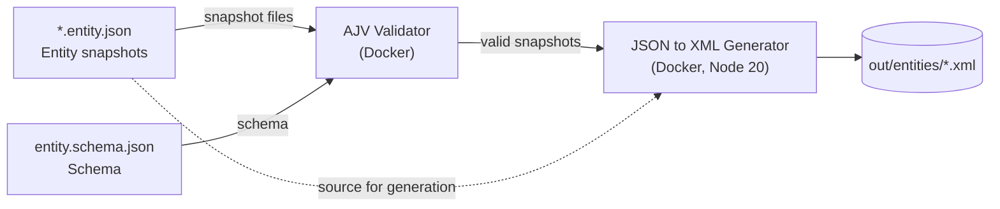

```mermaid
flowchart LR
  %% Authoring: source JSON snapshots and the schema
  A["*.entity.json\nEntity snapshots"]
  S["entity.schema.json\nSchema"]

  %% Validation: AJV-based validator runs inside Docker
  V["AJV Validator\n(Docker)"]

  %% Generation: JSON → XML generator (Node 20, Docker)
  G["JSON to XML Generator\n(Docker, Node 20)"]

  %% Output
  X[(out/entities/*.xml)]

  A -->|snapshot files| V
  S -->|schema| V
  V -->|valid snapshots| G
  G --> X

  %% optional: show that generator also reads snapshots directly
  A -.->|source for generation| G
```